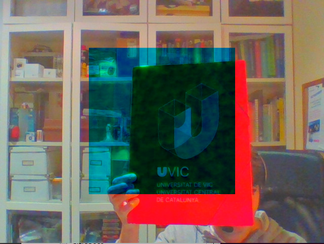

# webcam_capture
Just webcam capture

## Tips
https://wiki.archlinux.org/index.php/webcam_setup

http://www.linuxintro.org/wiki/Set_up_a_Webcam_with_Linux

## Project dependencies
This program uses OpenCV for accessing the webcam of your computer. In case you still don't have the library installed, you can do it by just:
```
sudo apt-get install libopencv-dev
```

## How to compile this project
After cloning the repository, just create an output directory and launch the build process from there:

```
mkdir build
cd build
cmake ..
make
```

## Launching the program
Once the build process has finished, launch the executable from the ***build*** directory with:

```
./webcam_capture
```
You will start seeing the webcam images, for example:


# Perception Exercise 1.2

For this exercise, 3 filters have been implemented into the application. Press the key 't' to toggle the type of filter being applied.
For further testing, you can also press the keys '+' and '-' to increase or decrease the size of window used in the filter.

Swapping color channels B and G:


Doing the grayscale image:


Doing the negative image:

